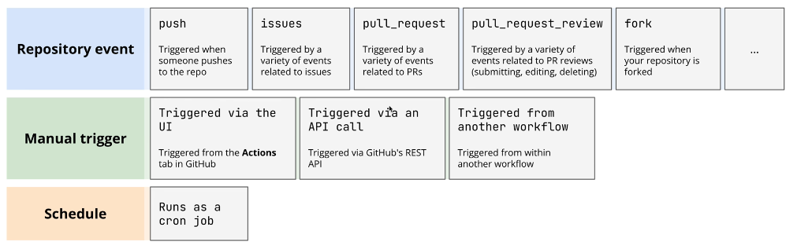

Workflow, Jobs, & Steps

Workflows:

- Are defined at the repository level
- Define which triggers actually start the workflow
- Are composed of one or more jobs.

Jobs:

- Are defined at the workflow level
- Define in which execution environment they are run (Linux, windows, mac)
- Are composed of one or more steps.
- Run in parallel by default.

Steps:

- Are defined at the job level
- Define the actual script or github action that will be executed.
- Run sequentially by default.

### Workflow Events
triggering workflows in multiple ways
There are many ways we can trigger GitHub workflows:

